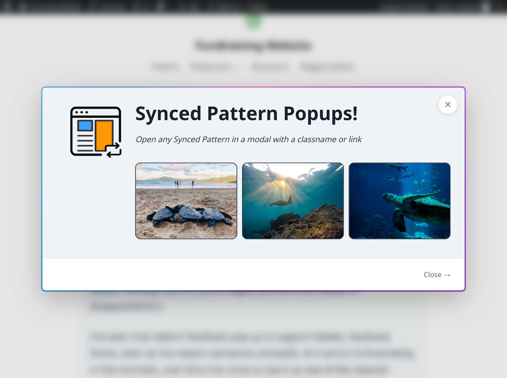
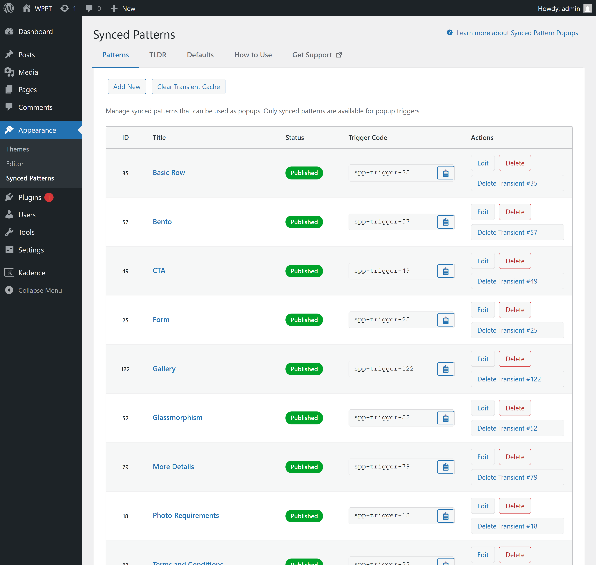
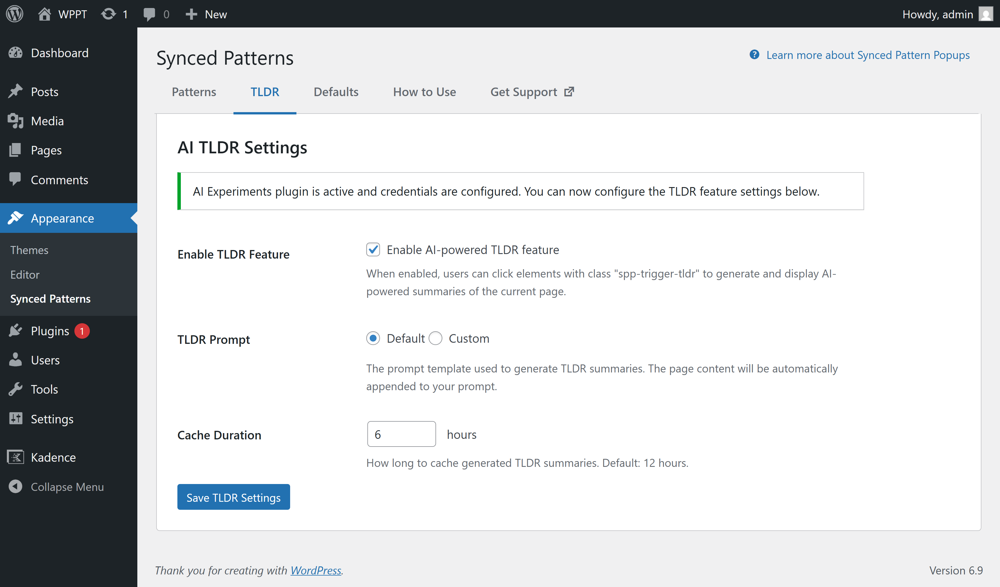

# Synced Pattern Popups

Developer-focused docs for the **Synced Pattern Popups** WordPress plugin.

This plugin lets you open a lightweight modal popup whose content comes from a WordPress **Synced Pattern** (`wp_block`), using simple triggers like `spp-trigger-{id}`.

## What are Synced Patterns?

Synced Patterns are reusable block layouts stored as `wp_block` posts. You can create them once and reuse them across your site. When you edit a synced pattern, every place it’s used updates automatically.

This plugin surfaces synced patterns with a dedicated admin screen at **Appearance → Synced Patterns**, where you can:
- Find pattern IDs at a glance
- Copy trigger snippets
- Edit/delete patterns
- Clear cached popup output per-pattern

## Screenshots (for WordPress.org)

These images live in `.wordpress-org/` for WordPress.org assets.







## How it works (high level)

1. You create popup content as a Synced Pattern (a `wp_block` post).
2. You place a trigger in content (`class="spp-trigger-{id}"` or `href="#spp-trigger-{id}"`).
3. When triggered, the plugin fetches the pattern content via AJAX and renders it in a modal.
4. The plugin collects and injects required block styles so the pattern renders correctly inside the modal.
5. Rendered output is cached (transients + object cache when available) and invalidated when patterns change.

## Triggers

### Pattern popup triggers
- **Class trigger**: `spp-trigger-{id}`
- **Href trigger**: `#spp-trigger-{id}` (useful in the Block Editor)

### Optional custom width
Use `spp-trigger-{id}-{width}` where `width` is in pixels (100-5000).

### TLDR trigger (optional)
Trigger TLDR generation with `spp-trigger-tldr` (class) or `#spp-trigger-tldr` (href).

## Architecture overview

The plugin is intentionally “no build” (vanilla JS/CSS, no bundler). Key responsibilities are split into small services:

- **`SPPopups_Plugin`**: front-end bootstrapping, asset enqueueing, modal output, cache invalidation hooks
- **`SPPopups_Ajax`**: AJAX endpoints (pattern render + TLDR), nonce + rate limiting
- **`SPPopups_Pattern`**: retrieves and renders synced patterns
- **`SPPopups_Asset_Collector`**: collects styles/scripts needed by rendered blocks so the modal looks correct
- **`SPPopups_Cache`**: transient/object-cache wrapper for rendered pattern output
- **`SPPopups_Admin`**: Appearance → Synced Patterns screen (tabs, list table, actions)
- **`SPPopups_Settings`**: TLDR settings UI and AI Experiments dependency checks
- **`SPPopups_TLDR`**: prompt composition, AI client call, TLDR caching
- **`SPPopups_Abilities`**: Abilities API registration (WordPress 6.9+)

## Hooks & filters (extension points)

Common extension points you can use from a theme or plugin:

### Customize popup cache TTL

```php
add_filter( 'sppopups_cache_ttl', function ( $ttl ) {
	return 6 * HOUR_IN_SECONDS;
} );
```

### Force assets on specific posts/pages
Useful when triggers are injected dynamically (AJAX/page builders/forms).

```php
add_filter( 'sppopups_force_assets', function ( $force, $post_id ) {
	if ( 123 === (int) $post_id ) {
		return true;
	}
	return $force;
}, 10, 2 );
```

## TLDR feature (AI Experiments dependency)

TLDR requires the **AI Experiments** plugin (`ai/ai.php`) to be installed/active and configured with credentials. The plugin provides a guided checklist UI in the TLDR tab.

## Abilities API (WordPress 6.9+)

If the WordPress Abilities API is available, the plugin registers abilities (e.g. render popup content programmatically).

Example:

```php
$result = wp_execute_ability(
	'sppopups/render-popup',
	array(
		'pattern_id' => 123,
	)
);
```

If the Abilities API isn’t available, the plugin skips registration without error.

## i18n / translations

- Text domain: `synced-pattern-popups`
- Translation templates live in `languages/`.

Generate/update the POT file with WP-CLI:

```bash
wp i18n make-pot . languages/synced-pattern-popups.pot
```

## Local development

No build step required.

1. Copy/clone into `wp-content/plugins/synced-pattern-popups/`
2. Activate in wp-admin
3. Create a synced pattern and add a trigger to any post/page

Relevant files:
- `includes/` - PHP
- `assets/js/modal.js` - front-end behavior
- `assets/js/admin.js` - admin UI behavior
- `assets/css/modal.css` / `assets/css/admin.css` - styling

## Support

- WordPress.org support forum: https://wordpress.org/support/plugin/synced-pattern-popups/
