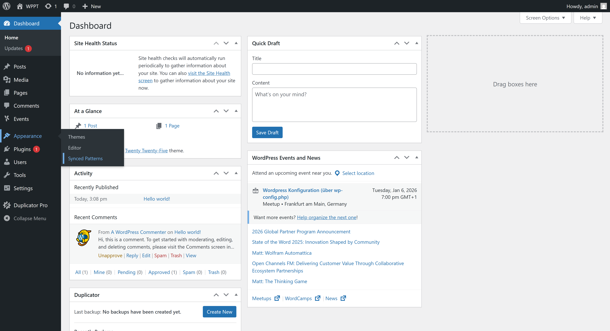
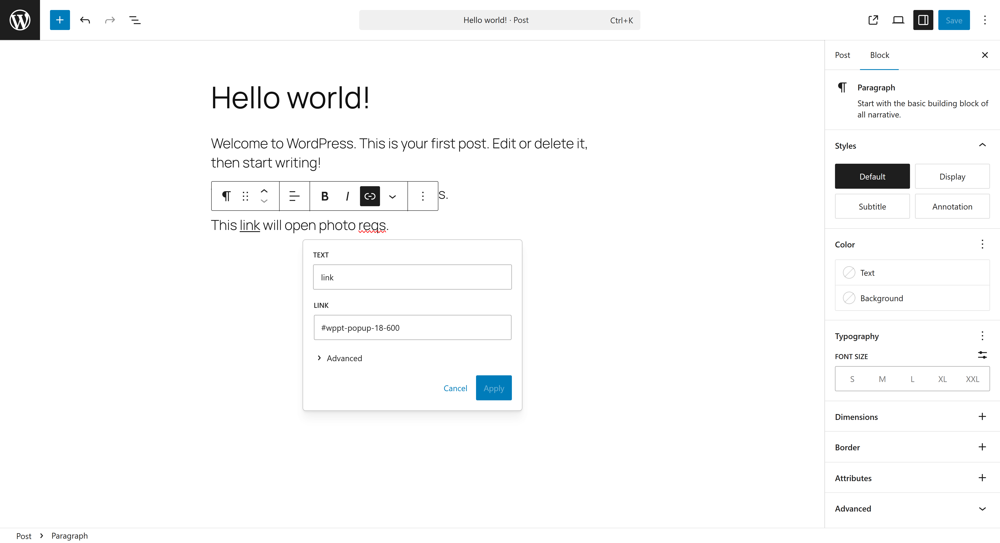
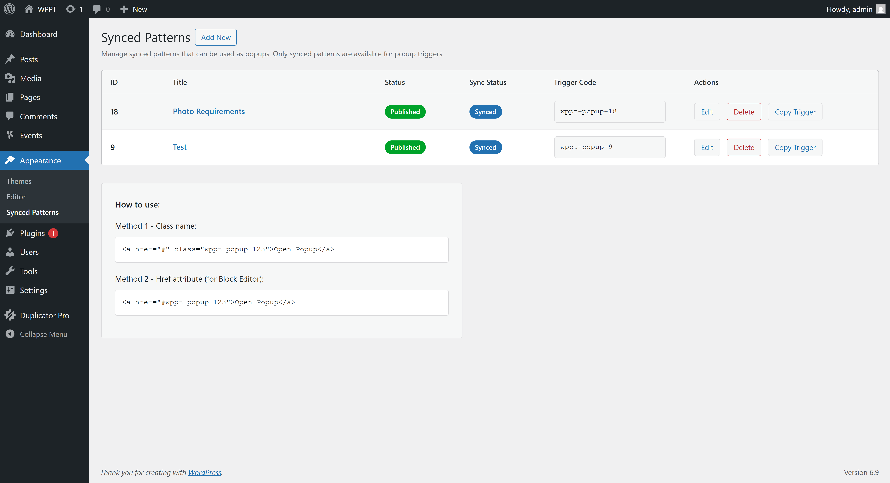
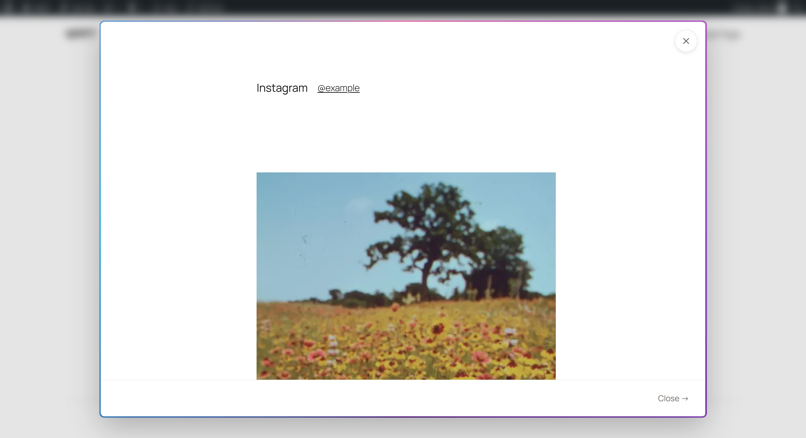
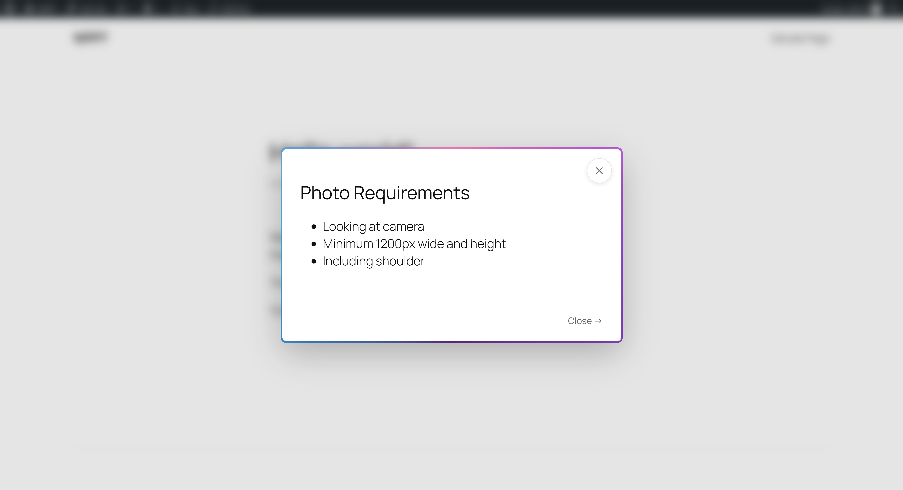

# The Simplest of Popups

A lightweight WordPress plugin that displays modal popups with content from WordPress Synced Patterns. No build process required - everything works out of the box.

## Features

- **Simple Trigger System**: Add class `wppt-popup-{id}` to any element to open a popup
- **Synced Pattern Integration**: Loads content from WordPress Synced Patterns dynamically
- **Admin Interface**: Manage synced patterns and easily find pattern IDs under Appearance → Synced Patterns
- **Security**: Nonce verification on all AJAX requests
- **Performance**: Cached rendered HTML for faster loading
- **No Build Process**: Plain CSS and JavaScript - works immediately after activation



*Synced Patterns menu item under Appearance*

## Installation

1. Upload the `simplest-popup` folder to `/wp-content/plugins/`
2. Activate the plugin through the 'Plugins' menu in WordPress
3. That's it! No configuration needed.

## Usage

### Basic Usage

You can trigger a popup in two ways:

#### Method 1: Class Name (Recommended for custom HTML)

Add the class `wppt-popup-{id}` to any clickable element, where `{id}` is the numeric ID of your Synced Pattern.

**Example:**
```html
<a href="#" class="wppt-popup-1359">Open Popup</a>
<button class="wppt-popup-1359">Click Me</button>
<div class="wppt-popup-1359" style="cursor: pointer;">Click here</div>
```

#### Method 2: Href Attribute (Perfect for Block Editor Links)

Set the `href` attribute to `#wppt-popup-{id}` on any link element. This is especially useful in the WordPress Block Editor where you can't easily add custom classes to links.

**Example:**
```html
<a href="#wppt-popup-1359">Open Popup</a>
```

**Block Editor Usage:**
1. Insert a Link block or add a link to text
2. Set the URL to `#wppt-popup-1359` (replace `1359` with your pattern ID)
3. The link will automatically trigger the popup when clicked



*Setting the href attribute in the Block Editor*

### Finding Your Synced Pattern ID

The easiest way to find pattern IDs is through the admin interface:

1. Go to **WordPress Admin → Appearance → Synced Patterns**
2. You'll see a table listing all available synced patterns
3. The **ID** column shows the pattern ID prominently (e.g., `1359`)
4. You can click the "Copy Trigger" button in the Actions column to copy the trigger code
5. The **Trigger Code** column shows the complete class name (e.g., `wppt-popup-1359`)



*The Synced Patterns admin interface showing all available patterns with their IDs and trigger codes*

**Note:** Only synced patterns (not unsynced patterns) can be used for popups. The admin interface only shows synced patterns.

### Per-Post Popup Support Toggle

If your trigger links are injected dynamically (e.g., inside Gravity Forms, AJAX-loaded content, or page builders), the plugin's automatic detection might not find them. In these cases, you can force the popup assets to load on a specific post/page.

**How to use:**

1. Edit the post/page where you have dynamic triggers
2. Look for the **"Synced Pattern Popup Support"** meta box in the sidebar
3. Change the toggle from **"Default"** to **"Forced On"**
4. Save the post

**When to use "Forced On":**
- Trigger links are inside Gravity Forms
- Content is loaded via AJAX after page load
- Page builders that inject content dynamically
- Any case where the trigger isn't in the raw post content

**When to use "Default":**
- Trigger links are in regular post content, blocks, or menus
- The plugin can automatically detect the triggers
- This covers 99% of use cases

### Multiple Popups on One Page

You can have multiple different popups on the same page - just use different pattern IDs. You can mix both methods:

```html
<!-- Using class names -->
<a href="#" class="wppt-popup-1359">Open Pattern 1359</a>
<button class="wppt-popup-1420">Open Pattern 1420</button>

<!-- Using href attributes (great for Block Editor) -->
<a href="#wppt-popup-1501">Open Pattern 1501</a>
```

### Modal Examples

The modal supports any content you can create in a Synced Pattern - from simple text to complex layouts with images, grids, and more.



*Example modal displaying an Instagram-style grid layout*



*Example modal with simple text and list content*

### Creating New Synced Patterns

1. Go to **WordPress Admin → Appearance → Synced Patterns**
2. Click the **"Add New"** button
3. This will take you to the pattern editor where you can create a new synced pattern
4. Make sure to enable the "Synced" option when creating the pattern (this is the default)
5. Once saved, the pattern will appear in the Synced Patterns list with its ID visible

## How It Works

1. User clicks an element with either:
   - Class `wppt-popup-{id}`, OR
   - Href attribute `#wppt-popup-{id}`
2. JavaScript extracts the numeric ID from the class name or href attribute
3. Modal opens with a loading spinner
4. AJAX request is sent to WordPress with nonce verification
5. Plugin verifies the pattern is a synced pattern (not unsynced)
6. Plugin checks cache first (for performance)
7. If not cached, loads the Synced Pattern and renders it
8. Rendered HTML is cached and displayed in the modal
9. User can close modal via close button, overlay click, or Escape key

## Security Features

- **Nonce Verification**: All AJAX requests require a valid WordPress nonce
- **Numeric ID Only**: Only accepts numeric pattern IDs (no slugs or titles) to reduce attack surface
- **Published Patterns Only**: Only loads published synced patterns
- **Synced Patterns Only**: Only synced patterns can be used for popups (unsynced patterns are excluded)

## Performance Features

- **Transient Caching**: Rendered HTML is cached for 12 hours by default
- **Automatic Cache Invalidation**: Cache is cleared when a synced pattern is updated
- **Cache TTL Filter**: Developers can adjust cache duration using the `simplest_popup_cache_ttl` filter

### Adjusting Cache Duration

Add this to your theme's `functions.php`:

```php
// Set cache to 1 hour instead of default 12 hours
add_filter( 'simplest_popup_cache_ttl', function() {
    return HOUR_IN_SECONDS;
});
```

## File Structure

```
simplest-popup/
├── simplest-popup.php          # Main plugin file
├── includes/
│   ├── class-simplest-popup-plugin.php          # Main plugin class
│   ├── class-simplest-popup-ajax.php            # AJAX handler
│   ├── class-simplest-popup-cache.php           # Cache service
│   ├── class-simplest-popup-pattern.php         # Pattern retrieval
│   └── class-simplest-popup-admin.php           # Admin interface
├── assets/
│   ├── css/
│   │   ├── modal.css          # Modal styles
│   │   └── admin.css          # Admin styles
│   ├── img/
│   │   └── screenshot-*.png   # Screenshots for documentation
│   └── js/
│       ├── modal.js           # Modal JavaScript
│       └── admin.js           # Admin JavaScript
└── README.md                  # This file
```

## Requirements

- WordPress 5.8 or higher
- PHP 7.4 or higher

## Browser Support

Works in all modern browsers that support:
- ES5 JavaScript (no build process needed)
- CSS3 (animations, backdrop-filter)
- Fetch API

## Troubleshooting

### Popup doesn't open

1. Check that you're using either:
   - Class name exactly `wppt-popup-{id}` where `{id}` is numeric, OR
   - Href attribute exactly `#wppt-popup-{id}` where `{id}` is numeric
2. Verify the synced pattern ID exists and is published
3. Verify the pattern is a synced pattern (check in Appearance → Synced Patterns)
4. Check browser console for JavaScript errors
5. Ensure the plugin is activated

### Content not loading

1. Verify the synced pattern ID is correct (check in Appearance → Synced Patterns)
2. Check that the pattern is published (not draft)
3. Verify the pattern is synced (not unsynced) - only synced patterns work
4. Check browser Network tab for AJAX errors
5. Verify nonce is being sent (check Network → Payload)

### Styling issues

The plugin uses minimal CSS. If you need to customize styles, you can override them in your theme's CSS using the same class names.

## License

GPL v2 or later

## Support

For issues or questions, please check the plugin documentation or contact support.

